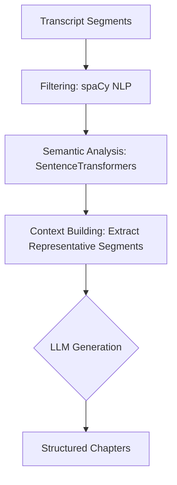

# Waypoint — AI Video Chapter Generator

## Overview

Waypoint is a simple AI-powered tool that automatically generates chapters for long-form videos.

Provide a video title and a publicly accessible VTT (WebVTT) transcript URL, and Waypoint analyzes the transcript to identify topic transitions and produce well-structured chapters.

The generated chapters make long videos easier to navigate, allowing viewers to jump directly to the topics they are interested in.

---

## Why Waypoint?

Educational lectures, webinars, and training videos are often an hour or longer. Manually creating chapters requires watching the entire video and noting where topics change, making it a repetitive and time-consuming task.

Waypoint automates this process in minutes, producing consistent, meaningful chapters without manual effort.

---

## How It Works

Waypoint utilizes a multi-step **transcript optimization chain** to analyze the video text before generation. Because raw video transcripts are often too large and unstructured for an LLM to process effectively, this pipeline extracts the most critical semantic transitions first.

### Architecture Flow

1. **Cleanup**: Parses the raw WebVTT and strips unnecessary timestamps and formatting, keeping only the raw text and cue timings.
2. **Filtering**: Uses NLP (`en_core_web_sm` via spaCy) to remove low-information cues and filler content that don't contribute to topic shifts.
3. **Semantic Analysis**: Employs SentenceTransformers (`all-MiniLM-L6-v2`) to embed the transcript segments, detecting semantic boundaries to group similar ideas together.
4. **Context Building**: Extracts the most representative segments for each semantic cluster, vastly reducing the transcript size while perfectly preserving key topic transitions.
5. **LLM Generation**: This optimized, dense context is injected into a prompt alongside the video title and sent to the LLM. The LLM's job is to assign clean, descriptive titles to the pre-identified transition points.